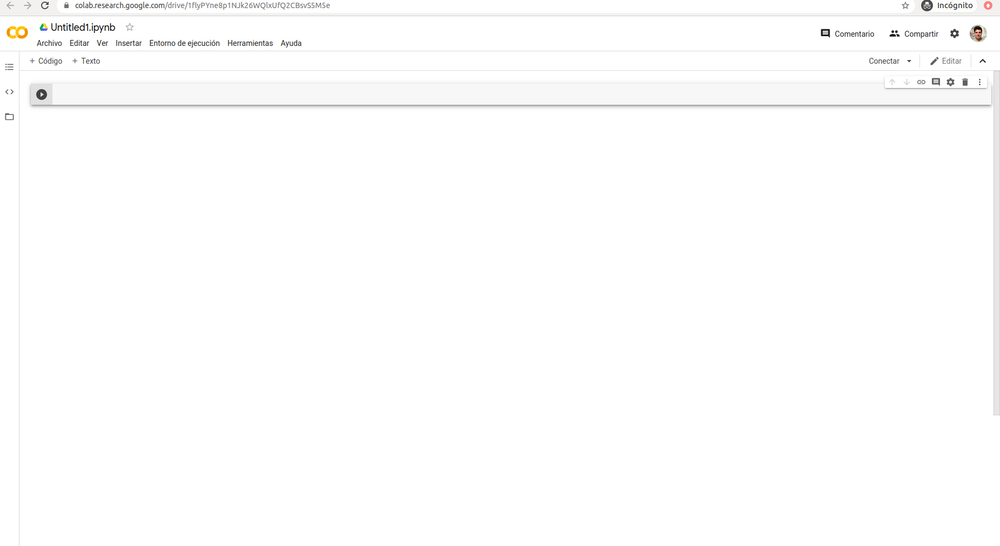
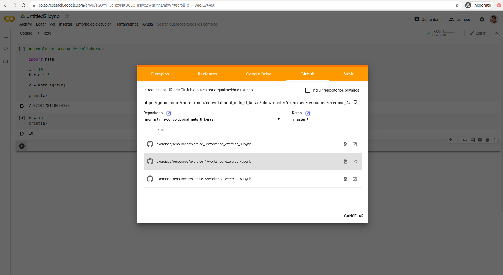

## Taller de construcción de redes de neuronas convolucionales 
### Machine Learning, Tensor Flow, Keras, Redes de neuronas

## Ejercicio 2 - Jupyter Notebook sobre Collaborate

El objetivo de este ejercicio es aprender a utilizar el entorno de trabajo colaborate con el objetivo de utilizar el servidor Notebook que ofrece para el desarrollo de sistemas de construcción de modelos aprendizaje para la resolución de este taller. 

**Paso 1: Accediendo a colaborate**

El primer paso consiste en acceder al entorno [Collaborate](https://colab.research.google.com/notebooks/intro.ipynb). Para ello tendremos que iniciar sesión mediante nuestra cuenta de gmail en parte superior derecha como se muestra en la imagen.


**Paso 2: Creando nuestro primer notebook con collaborate**

Tras iniciar sesión mediante nuestra cuenta de gmail se nos permitirá crear nuestros notebooks para el desarrollo de nuestros sistemas de aprendizaje. Realmente, collaborate nos permite crear cualquier tipo de código basado en python. Una vez que hemos accedido al entorno podemos crear un nuevo cuaderno en el menu superior izquierdo pulsando en archivo -> nuevo cuaderno, lo que nos mostrará un nuevo cuaderno vacio como se muestra en la siguiente imagen. 



Este interfaz nos permite crear incluir fragmentos de código python y ejecutarlos de manera independiente para luego analizar su resultado, que se muestra a continuación, una vez que ha sido ejecutado, cada uno de estos fragmentos es representado por una celda con bordes redondeados. 


**Paso 3: Creando nuestro primer fragmento de código**

Los fragmentos de código permiten incluir cualquier tipo de código en el lenguaje python, por lo que podríamos incluir el siguiente fragmento de código y comprobar su funcionamiento:

```
#Ejemplo de prueba de collaborate

import math

a = 10
b = a * 5

c = math.sqrt(b)

print(c)
```


La ejecución del fragmento de código se realiza pulsando en el esfera negra con el símbolo de play que se encuentra en la parte superior izquierda del área del fragmenta. Esta esfera cambiará su color. forma o producirá una animación dependiendo del estado en el que se encuentre el fragmento:

- Color negro y con símbolo triangular (play): Significa que el fragmento puede ser ejecutado.
- Color negro y con símbolo cuadrado (stop): Significa que el fragmento está en ejecución.
- Color rojo y con símbolo triangular (play): Significa que ha habido un error de ejecución en el fragmento. En ese caso se indicará el error a continuación.
- Corchetes con un número: Significado el orden en el que se ejecuto el fragmento desde que fue creado el cuaderno. 

Para poder crear un nuevo fragmento, se puede pulsar la tecla Shift+Enter siempre y cuando el curso se encuentre en la sección de código de otro fragmento. Esto producirá la aparición de nuevo fragmento a continuación y realizará la ejecución del actual fragmento. 

**Paso 4: Ccargando jupyter código desde Github**

Es posible cargar un cuaderno que existe en un repositorio. En este taller, vamos a poder utilizar los cuadernos de guía que existen en repositorio. Para ello tendremos que seleccionar en el menú superior izquierdo __Subir cuaderno__ en el menú de __Archivo__. A continuación nos aparecerá la ventana mostrada en el imagen que nos permitirá cargar cuadernos desde diferentes localizaciones (Google drive, Github, ordenador, etc).  


Para poder cargar nuestro cuaderno desde github, tenemos que seleccionar la opción 4 e incluir la url del cuaderno que queremos cargar. Para ello deberemos seleccionar la url e introducirla en la casilla de búsqueda y pulsar en el icono de la lupa. Este proceso cargará nuestro cuaderno y podremos empezar a trabajar. Si no pulsamos el icono de la lupa se realizará un búsqueda en el repositorio y collaborate nos mostrará todos lo cuadernos disponibles en dicho repositorio de forma que podemos seleccionar aquel sobre el cual queramos trabajar. 



**Paso 5: Ccargando jupyter código desde nuestro ordenador**

También es posible cargar nuestros cuadernos desde nuestro propio ordenador. Para ello tendremos que seleccionar en el menú superior izquierdo __Subir cuaderno__ en el menú de __Archivo__. En al ventata que aparecerá a continuación tendremos que seleccionar la opción 5 y seleccionar el cuaderno en el sistema de ficheros de nuestro ordenador como se muestra en la siguiente imagen.


