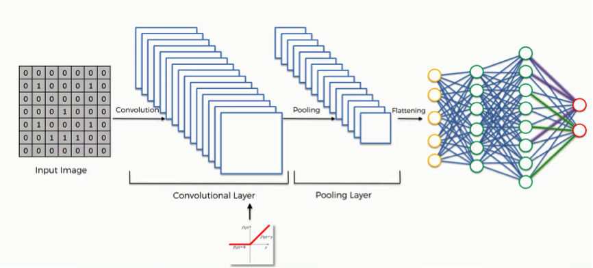
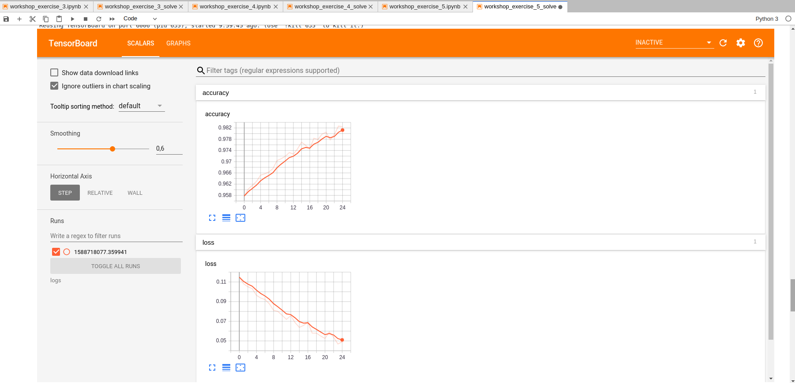

## Taller de construcción de redes de neuronas convolucionales 
### Machine Learning, Tensor Flow, Keras, Redes de neuronas

## Ejercicio 4 - Desarrollo de una red convolucional con Keras

El objetivo de este ejercicio es construir nuestra red de neuronas convolucional mediante la utilización de Keras. Para su realización vamos a reutilizar parte del código que hemos desarrollado en el (ejercicio 3)[./ejercicio_3.md]. 

**Paso 1: Instalación de paquetes y despligue de TensorFlow Board**

En este primer paso hay que incluir los paquetes que deben ser instalados con el objetivo de utilizar keras y TensorFlow Board. Para ello es necesario incluir el siguiente código al inicio del cuaderno. 

```
!pip install pandas scikit-learn numpy seaborn matplotlib numpy keras tensorflow==1.15 requests
```

Este comando permite cargar la extensión de TensorFlow Board dentro de los cuadernos juputer, de forma que se despligue de manera embebida. 

```
%load_ext tensorboard
```

**Paso 2. Definición de paquetes a importar**

Para la realización de este ejercicio tenemos que importar nuevas librerías relacionadas con keras. Para ello es necesario modificar los paquetes importados que vamos a utilizar con respecto al ejercicio anterior. 

```
import input_data
import numpy as np
import matplotlib.pyplot as plt
import tensorflow as tf
import os
import os.path
import requests 
import math
import datetime
from time import time

from keras.callbacks import TensorBoard
from keras.models import Sequential
from keras.layers import Dense, Conv2D, Flatten, MaxPooling2D, Dropout
from keras import optimizers
from keras.utils import plot_model
from keras.models import model_from_json
```

Para el desarrollo de los diferentes ejercicios vamos a necesitar un conjunto de liberías que servirán para lo siguiente:

* input_data: Nos ofrece funcionalidad para cargar la información utilizando el formato propuesto por MNist. 
* numpy: Nos ofrece funcionalidad para la manipulación de arrays y conjunto de datos. 
* matplotlib: Nos ofrece funcionalidad para la visualización de datos. 
* tensorflow: Nos ofrece funcionalidad para la construacción de procesos de entrenamiento. 
* os: Nos ofrece funcionalidad para la manipulación de recursos del sistema operativo. 
* os.path: Nos ofrece funcionalidad para la manipulación del sistema de ficheros del sistema operativo.
* requests: Nos ofrece funcionalidad para la descarga de archivos.
* math: Nos ofrece funcionalidad para la realización de operaciones matemáticas complejos (no elementales).
* time: Nos ofrece funcionalidad para la obtención de information referente al tiempo, para crear contadores o archivos de log. 
* Keras.model: Nos ofrece diferente tipo de modelos, en este caso vamos a utilizar el modelo secuencial. 
* Keras.layers: Nos ofrece diferentes tipo de capas para incluir en una red de neuronas.
* optimizers from keras: Nos ofrece diferentes tipos de algoritmos de optimización, en nuestro caso utilizaremos el optimizador de Adams. 
* Keras.utils: Nos ofrece diferentes funcionalidades para obtener información de la red construida. 
* TensorBoard: Nos ofrece diferentes funcionalidades para cargar información en tensorborad y poder visualizar la evoluación de nuestros algoritmos. 


**Paso 3. Definición de conjuntos de entrenamiento y test para el proceso de entrenamiento**

El primer paso consiste en dividir la información entre los conjuntos de entrenamiento y test. Para ello crearemos 4 variables denominadas train y test e identificadas con __X__ para los ejemplos e __y__ para las clases o etiquetas (labels). 

```
train_X = full_data.train.images
test_X = full_data.test.images

train_y = full_data.train.labels
test_y = full_data.test.labels

n_input = image_size * image_size
n_output = len(LABELS)
```

Para la construcción de la red de neuronas vamos a definir una serie de variables para almacenar la información de la entrada y la salida:

- n_input: Se corresponde con el número de neuronas de entrada.
- n_output: Se corresponde con el número de neuronas de salida. Este valor se corresponderá con el número de labels o etiquetas. 

**Paso 4. Inicialización del grafo (TensorFLow)**

TensorFlow es una framework que transforma el código fuente en grafo de operaciones que pueden ser ejecutadas de forma secuencial o paralela dependiendo de sus interacciones. Con el objetivo de eliminar cualquier tipo de información previo tenemos que resetear el grafo por defecto. 

```
tf.reset_default_graph()
```

**Paso 5. Inicialización de placeHolders**

Una vez que hemos definido la función de generación, podemos construir nuestra red de neuronas y definir las variables necesarias para el proceso de aprendiaje.  En este caso utilizaremos sólo los placeholders de tensorflow:

- placeholder: Son las variables de entrada (inputs) y salida (output) del algoritmo. Se generan mediante el método __tf.placeholder__ y se utilizan para definir el grafo de tensorflow sin la necesidad de haberles asignado un valor inicial. 

```
x = tf.placeholder("float", [None, n_input])
y = tf.placeholder("float", [None, n_output])
```

**Paso 6. Generación de la red**

Una vez definadas la variables de entrada y salida con su formato (shape) podemos construir nuestra red de neuronas que estará compuesta de tres 4 capas: 

- Capa convolucional 1: Capa convolucional que aplica un filtro convolucional de 3 x 3, pooling de 2 x 2 con una función de activación ReLU con entrada de 28 neuronas y salida de 32 neuronas. 
- Capa convolucional 2: Capa convolucional que aplica un filtro convolucional de 3 x 3, pooling de 2 x 2 con una función de activación ReLU con entrada de 32 neuronas y salida de 64 neuronas. 
- Capa fully connected: Capa de tipo flaten que aplana la información en un array. Se suele utilizar como capa inicial para aplanar la imagen de entrada que se corresponde con una matriz y transformarla en un secuencia de píxeles.
- Capa salida: Capa de salida densa con entrada de 1600 neuronas y salida de 10 neuronas (labels). 

```
net = Sequential(name="KerasCNN")
net.add(Conv2D(32, kernel_size=3, activation='relu', input_shape=(28,28,1)))
net.add(MaxPooling2D(pool_size=2))
net.add(Conv2D(64, kernel_size=3, activation='relu'))
net.add(MaxPooling2D(pool_size=2))
net.add(Flatten())
net.add(Dense(10, activation='softmax'))
net.add(Dropout(0.2))
```




**Paso 7. Definición de función de optimización**

A continuación tenemos que definir la función de obtimización que utilizaremos para minimizar el valor de función de coste. Para este ejecicio vamos a utilizar el algoritmo de [Adam](https://arxiv.org/abs/1412.6980https://arxiv.org/abs/1412.6980) con el fin de minimizar el coste del error mediante la función __optimizers.Adam__. 

```
optimizer = optimizers.Adam(learning_rate=0.002, beta_1=0.9, beta_2=0.999)
```

**Paso 8. Compilación de la red**

A continuación debemos compilar nuestra red utilizando un algoritmo de optimización, una función de loss, que en este caso utilizado la función de cruze de entropia categorizada y por último definimos la metrica que utilizaremos para el proceso de entrenamiento que será el __accuracy__. 

```
net.compile(optimizer=optimizer, loss='categorical_crossentropy', metrics=['accuracy'])
net.summary()
```

Además una vez compilada la red, utilizaremos la función __summary__ que nos presenta un resumen de la estructura de la red que hemos creado (capas, orden de las capas, variables a entrenar, etc). 

**Paso 9. Definición de bucle de entrenamiento (Función)**

Una vez que se han definido todas las variables y funciones necesarias para el proceso de aprendizaje, podemos crear la función de entrenamiento. En este caso la función es muy sencilla y formada por tres parámetros:

- net: Que se corresponde con la red secuencial que hemos definido previamente.
- training_iters: Que se corresponde con el número de iteraciones del proceso de entrenamiento.
- batch_size: Que se corresponde con el tamaño de los conjuntos de entrenamiento que se utilizarán. 


Esta función realiza una reestructuración de los datos de los conjuntos de entrenamiento y test para ajustarlos al formato y tamaño de las imágenes que hemos definido en caso de que existe alguna discrepancia y ejecuta el proceso de entrenamiento mediante la utilización del método __fit__ que ejecuta un proceso similar al que definimos en el ejercicio anterior. Además en este caso incluimos un __callback__ con el objetio de recolectar información que nos permita visualizar la evolución del proceso de entrenamiento mediante TensorBoard. 

```
logdir = "./logs/scalars/" + datetime.datetime.now().strftime("%Y%m%d-%H%M%S")

def train(net, training_iters, batch_size = 128):
    
    num_images = train_X.shape[0]
    x_shaped_array = train_X.reshape(len(train_X), 28, 28, 1)
    x_test_shaped_array = test_X.reshape(len(test_X), 28, 28, 1)

    tensorboard_callback = TensorBoard(log_dir='logs/{}'.format(time()))
    
    net.fit(
      x_shaped_array,
      train_y,
      batch_size=batch_size,
      epochs=training_iters,
      validation_data=(x_test_shaped_array, test_y),
      callbacks=[tensorboard_callback]
    )
    
    return net
```

**Paso 10. Ejecución del proceso de entrenamiento**

Una vez construidas nuestras funciones podemos ejecutar nuestro proceso de aprendizaje de la siguiente manera, ejecutando el proceso de aprendizaje durante 100 iteraciones con una tasa de aprendizaje del 0.001 y un tamaño de batch de 128 imágenes. 

```
final_net = train(net, 10, 128)
print_results(final_net)
```

**Paso 11. Visualización de los resultados con TensorFlowBoard**

Es posible visualizar la información mediante TensorFlow Board con el objetivo de poder obtener toda la información sobre el proceso de aprendizaje. Para ello es necesario incluir el siguiente comando y ejercutar el fragmento del cuarderno. TensorBoard utilizar los ficheros de logs que se han generado en el fichero que indiquemos como valor del parámetro __logdir__, que en este caso se corresponde con la carpeta logs que hemos utilizado para almacenzar los logs generados en el proceso de entrenamiento del paso 10. 

```
%tensorboard --logdir logs
```

Tras la ejecución podremos ver a través del interfaz web, embevida en nuestro cuaderno, el resultado de nuestro proceso de aprendizaje, como se muestra en la siguiente imagen:



Si ejecutamos este comando antes del proceso de aprendizaje podremos ver en tiempo real la evolución del proceso, ya que TensorBoard tiene un sistema de refresco de 30 segundos. 


